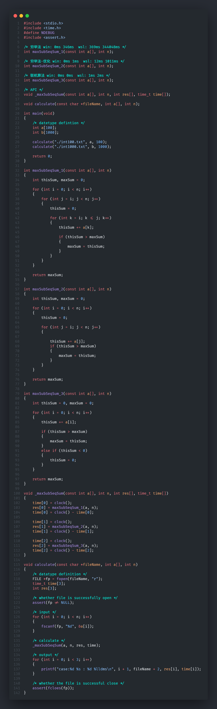

# 第一章 作业

## 一. 选择题

1. 从逻辑上可以把数据结构分为（   ==C==   ）两大类

 A. 动态结构、静态结构     B. 顺序结构、链式结构

 C. 线性结构、非线性结构 D. 初等结构、构造型结构

2. 下面关于算法的说法正确的是（   ==D==   ）

 A. 算法的时间复杂度一般与算法的空间复杂度成正比

 B. 解决某问题的算法可能有多种，但肯定采用相同的数据结构

 C. 算法的可行性是指算法的指令不能有二义性

 D. 同一个算法，一般情况下实现语言的级别越高，执行效率越低。

3. 在发生非法操作时，算法能够做出适当处理的特性称为（   ==B==   ）

 A.   正确性     B. 健壮性     C. 可读性     D. 可移植性

## 二.  判断题

1. 数据的逻辑结构是指数据的各数据项之间的逻辑关系（   ❌   ）
2. 顺序存储方式的优点是存储密度大，且插入、删除运算效率高（   ❌   ）
3. 数据的逻辑结构说明数据元素之间的次序关系，它依赖于数据的存储结构（   ❌   ）
4. 算法的优劣与描述算法的语言无关，但与所用的计算机性能有关（   ❌   ）
5. 算法必须有输出，但可以没有输入（   ✅   ）

## 三.   简答题 

1. 分析程序段中带“#”语句的执行频度，并给出程序段的时间复杂度

​	a. 第一小题

```C
j=1; k=0;
while(j<=n-1){
    j++;
    k+=j; //#
}
```

> **答：**`k+=j`执行$n-1$次，程序时间复杂度为$O(n)$

​	b. 第二小题

```C
设n是偶数
for(i=1, s=0; i<=n; i++){
    for(j=2*i; j<=n; j++){
        s++; //#
    }
}
```

> **答：**`s++`执行$\dfrac{n^2}{4}$次，程序时间复杂度为$O(n^2)$

​	c. 第三小题

```C
k=0;
for(i=0; i<n; i++){
    for(j=i; j<n; j++){
        k++; //#
    }
}
```

> **答：**`k++`执行$\dfrac{n(n+1)}{2}$次，程序时间复杂度为$O(n^2)$

​	d. 第四小题

```C
k=0；
for(i=0; i<n; i++){
    for(j=1; j<n; j<<=1){
        k++; //#
    }
}
```

> **答：**`k++`执行$n\lfloor\log n\rfloor$次，程序时间复杂度为$O(n\log n)$

2. 有的情况下，算法中基本操作重复执行的次数还随问题的输入数据集不同而不同。假定对包含1、2、3、4、5共5个元素的序列（即n=5）做冒泡排序，请举例说明何时会出现以下情况：
   a. 任何元素都无需移动；

   >   `{1, 2, 3, 4, 5}`

   b. 某元素会一度朝着远离期最终位置的方向移动；

   >  `{5, 4, 1, 2, 3}`

   c. 某元素的初始时已位于最终位置，却需要参与n-1次交换；

   >   `{4, 5, 3, 1, 2}`

   d. 所有元素都需要参与n-1次交换。

   >   `{5, 4, 3, 2, 1}`

3. 阅读高质量C++/C编程指南，电子版文档：https://www.doc88.com/p-210659243742.html，回答以下问题
   a. 头文件的作用是什么，头文件中为什么有`ifndef/define/endif`结构的预处理块

   > **头文件作用：**
   >
   > (1)通过头文件来调用库功能；
   > (2)头文件能加强类型安全检查.

   > **ifndef/define/endif结构的预处理块：**
   >
   > 防止头文件被重复引用.

   b. 引用和指针有何区别？下面代码中的Test函数的语句`GetMemory(str, 200)`并没有使`str`获取期望的内存，`str`依旧是NULL，请问是为什么，应该如何修改？

   

   > **区别：**
   >
   > (1)引用相当于对某个变量取别名 `int &n = m;` 那么n就相当于m的别名，n就是m本身；而指针是一个变量，存储一个地址，指向内存中的一个存储单元;
   > (2)引用被创建的同时必须被初始化而指针可以在任何时候被初始化;
   > (3)引用必须与合法的存储单元关联，而指针可以用NULL引用;
   > (4)引用一旦被初始化，就不能改变引用的关系，而指针可以随时改变所指的对象.

   > **原因：**
   >
   > 由于`GetMemory`函数体内的p是指向外部变量`str`的指针，只能改变指针的内容，而不能改变指针本身的指向.

   > **修改：**
   >
   > ```c
   > void GetMomory(char **p, int num) {
   >     p = (char *)malloc(sizeof(char) * num);
   > }
   > GetMemory(&str, 100);
   > ```

   c. 函数体内的局部变量在函数结束时会自动消亡，那么函数体内动态申请的内存是否会自动释放？

   

   > 不会自动释放.
   > 动态申请的内存是在堆里分配的，除非是程序完全退出才释放，或者使用free函数进行释放.
   > 并且指针消亡了，并不表示它所指向的内存会被自动释放；
   > 并且内存被释放，并不表示指针会消亡或者成了NULL指针

   d. 在调试程序时如果一个循环在执行100次后会出现问题，应如何设置断点进行调试？在调试程序时如果需要在被监控变量的值发生改变时停止执行进行分析，应如何设置？

   > (1)在`for`循环中设置断点，并且设置条件`i > 100`，`(gdb)break (此for内) if i > 100 `
   >
   > (2)使用`(gdb)watch`命令，只有当被监控变量（表达式）的值发生改变，程序才会停止运行.

## 四.   编程题

最大子序列求和问题，分别采用PPT中求最大子序列和的算法1、算法2、算法4求以下两个分别包含100个整数`int100.txt`和1000个整数`int1000.txt`的最大连续子序列和

要求如下：

1. 编写代码完成测试数据文件的读取
2. 分别采用三种算法求最大连续子序列和
3. 记录三种算法的运行时间


