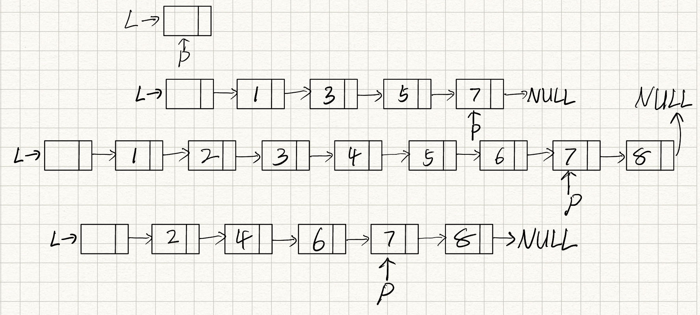

# 2022数据结构-第二章作业

## 1. 简答题

#### 1. 画出执行下列各行语句最终的各指针及链表的示意图

```c
L = (LinkList)malloc(sizeof(LNode));
p = L;
for (i=4; i<=4; i++) {
    p->next = (LinkList)malloc(sizeof(LNode));
    p = p->next;
    p->data = i * 2 - 1;
}
p->next = NULL;
for (i=4; i>=1; i--) {
    Ins_LinkList(L, i+1, i*2);
}
for (i=1; i<=3; i++) {
    Del_LinkList(L, i);
}
```



#### 2. 已知$P$结点是某双向链表的中间结点，写出以下操作的语句序列

* 在P结点后插入S结点的语句序列；

  ```c++
  P->next->prior = S;
  S->next = P->next;
  P->next = S;
  S->prior = P;
  ```

* 在P结点前插入S结点的语句序列；

  ```c++
  P->prior->next = S;
  S->prior = P->prior;
  S->next = P;
  P->prior = S;
  ```

* 删除P结点的直接后继结点的语句序列；

  ```c++
  q = P->next;
  P->next = P->next->next;
  P->next->prior = P;
  delete q;
  ```

* 删除P结点的直接前驱结点的语句序列；

  ```c++
  q = P->prior;
  P->prior = P->prior->prior;
  P->prior->next = P;
  delete q;
  ```

* 删除P结点的语句序列

  ```c++
  P->prior->next = P->next;
  P->next->prior = P->prior;
  delete P;
  ```

#### 3. 简述以下算法功能

##### a. 第1小题

```c++
Status A(LinkedList &L) {// L是无头结点的单链表
    if (L && L->next) {
        Q = L; L = L->next; P = L;
        while (P->next) P = P->next;
        P->next = Q; Q->next = NULL;
    }
    return OK;
}
```

> ##### 答：如果L的长度不小于2，将L原头结点变成尾结点

##### b. 第2小题

```c
void BB(LNode *s, LNode *q) {
    p = s;
    while (p->next != q) p = p->next;
    p->next = s;
}//BB

void AA(LNode *pa, LNode *pb) {
    //pa和pb分别指向不带头结点单循环链表中的两个结点
    BB (pa, pb);
    BB (pb, pa);
}//AA
```

> ##### 答：将一个单循环链表从pa、pb处拆成两个单循环链表

## 3. 算法设计题

##### 1. 从一个给定的顺序表L中删除值在$x\sim y$ （$x\leqslant y$）之间的所有元素，要求以较高的效率来实现，写出算法伪代码并分析你的算法时间复杂度（提示：移动位置一步到位）

```c++
void DelBetweenXandY(SqList &L, ElemType x, ElemType y) {
    int i, k = 0;
    for (i=0; i<L.length; i++) {
        if (L.data[i] < x || L.data[i] > y) {
            L.data[k++] = L.data[i];
        }
    }
    L.length = k;
} // 时间复杂度O(n)
```

##### 2. 设计一个空间复杂度为$O(1)$的算法`shift(SqList L, int k)`将顺序表L中的元素整体循环左移k位，要求以较高的效率来实现，写出算法伪代码并分析你的算法时间复杂度

```c++
void reverse(SqList &L, int l, int r) {
    while (l < r) {
        std::swap(L.data[l], L.data[r]);
        l++, r--;
    }
}
void shift(SqList &L, int k) {
    k %= L.length; // 通过数学运算发现只需翻转三次即可，O(n*2)
    reverse(L, 0, L.length - 1);
    reverse(L, 0, k - 1);
    reverse(L, k, L.length - 1);
} // 时间复杂度O(n)
```

##### 3. 设计一个算法删除一个单链表倒数第k个结点

```c++
void DelNthFromEnd(LinkList &L, int k) { // 有头结点
    fast = L->next;
    while (k--) {
        fast = fast->next;
    }
    slow = L->next;
    while (fast) {
        fast = fast->next;
        slow = slow->next;
    }
    q = slow->next;
    slow->next = slow->next->next;
    delete slow;
}
```

##### 4. 设计一个算法检测一个单链表L上是否因为某种错误操作而出现了环

```c++
bool ExistLoop(LinkList L) {
    if (L == nullptr || L->next == nullptr) {
        return false;
    }
    fast = L;
    slow = L->next;
    while (slow != fast) {
        if (fast == nullptr || fast->next == nullptr) {
            return false;
        }
        slow = slow->next;
        fast = fast->next->next;
    }
    return true;
} // 快慢指针
```