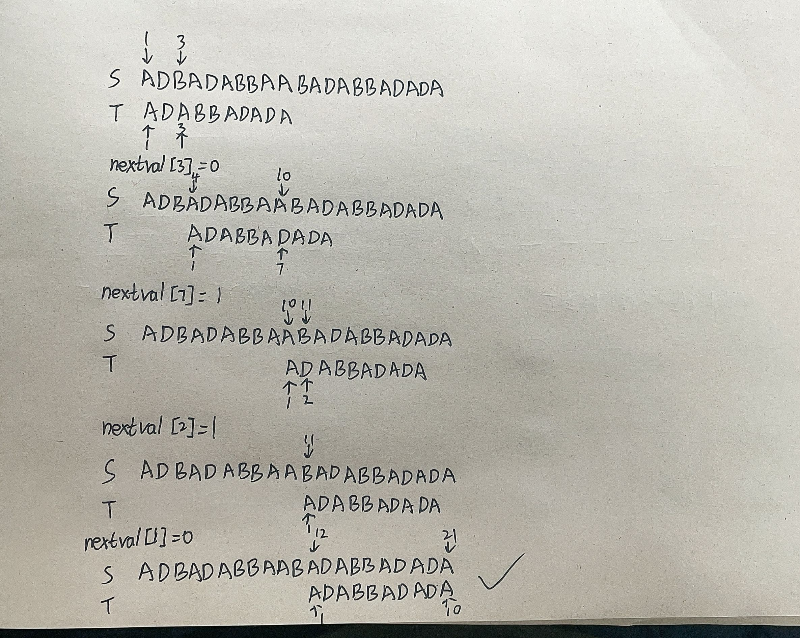

# 2022数据结构-第三四章作业

## 一、选择题

1. #### 向一个栈顶指针为top的链栈中插入一个p所指结点时，其操作步骤为（==C==） 

   a. `top->next=p;`
   b. `p->next=top->next; top->next=p;` 
   c. `p->next=top; top=p;`
   d. `p->next=top;  top=top->next;` 

2. #### 一个栈的入栈序列是a,b,c,d,e,则栈的不可能的输出序列是（==C==） 

   a. `edcba`；
   b. `decba`;
   c. `dceab`;
   d. `abcde`;

3. #### 在一个链队列中，若f,r分别为队首、队尾指针，则插入p所指结点的操作为（==B==） 

   a. `f->next=p;  f=p;`
   b. `r->next=p; r=p;`
   c. `p->next=r; r=p;` 
   d. `p->next=f;  f=p;`

4. #### 用不带头结点的单链表存储队列时，在进行删除运算时（==D==） 

   a. 仅修改头指针
   b. 仅修改尾指针;
   c. 头尾指针都要修改;
   d. 头、尾指针可能都要修改; 

## 二、简答题

1. #### 简述以下算法的功能

   ```c++
   Status a1go1(Stack S){
       int i,n, A[255];
       n=0;
       while(!StackEmpty(S)){n++; Pop(S, A[n]);};
       for(i=1; i<=n; i++) Push(S,A[i]);
   }
   ```

   > 答：将栈中元素逆置

2. #### 简述以下算法的功能

   ```c++
   Status algo2(Stack S, int e){
       Stack T; int d;
       InitStack(T);
       while(!StackEmpty(S)){
           Pop(S,d);
           if(d!=e) Push(T,d);
       }
       while(!StackEmpty(T)){
           Pop(T, d);
           Push(S,d);
       }
   }
   ```

   > 答：删除栈`S`中所有值为`e`的元素

3. #### 简述以下算法的功能

   ```c++
   void algo3(Queue &Q){
       Stack S; int d;
       InitStack(S);
       while(!QeueuEmpty(Q)){
           DeQueue(Q,d);
           Push(S,d);
       }
       while(!StackEmpty(S)){
           Pop(S,d);
           EnQueue(Q,d);
       }
   }
   ```

   > 答：将队列逆置

4. #### 画出对表达式：3-2*8/4+3^2 求值时，操作数栈和运算符栈的变化过程

   > $$
   > \begin{flalign*}
   > &
   > \begin{cases}
   > Data: & 3 \\
   > Operation: & -\\
   > \end{cases} \quad \qquad
   > \begin{cases}
   > Data: & 3 & 2\\
   > Operation: & - & *\\
   > \end{cases} \quad \qquad
   > \begin{cases}
   > Data: & 3 & 2 & 8\\
   > Operation: & - & *\\
   > \end{cases} &\\
   > &
   > \begin{cases}
   > Data: & 3 & 16\\
   > Operation: & - & / \\
   > \end{cases} \quad
   > \begin{cases}
   > Data: & 3 & 16 & 4\\
   > Operation: & - & /\\
   > \end{cases} \quad
   > \begin{cases}
   > Data: & 3 & 4 \\
   > Operation: & - \\
   > \end{cases} &\\
   > &
   > \begin{cases}
   > Data: & -1 \\
   > Operation: & +\\
   > \end{cases} \qquad \ \
   > \begin{cases}
   > Data: & -1 & 3\\
   > Operation: & + & \hat \\
   > \end{cases} \qquad \ \
   > \begin{cases}
   > Data: & -1 & 3 & 2\\
   > Operation: & + & \hat \\
   > \end{cases} & \\
   > &
   > \begin{cases}
   > Data: & -1 & 9 \\
   > Operation: & + \\
   > \end{cases} \quad
   > \begin{cases}
   > Data: & 8 \\
   > Operation: \\
   > \end{cases}
   > \end{flalign*}
   > $$

5. #### 已知主串`s = 'ADBADABBAABADABBADADA'`，模式串`pat = 'ADABBADADA'`，写出模式串的`nextval`函数值，并由此画出`KMP`算法匹配的过程

   | pat         | `ADABBADADA` |
   | ----------- | ------------ |
   | **next**    | `0112112343` |
   | **nextval** | `0102101040` |
   
   

## 三、算法设计题（只需要写出函数伪代码）

1. #### 假设以顺序存储结构实现一个双向栈，即在一维数组的存储空间中存在着两个栈，它们的栈底分别设在数组的两个端点。试编写

   实现这个双向栈tws的三个操作：

   a. 初始化栈`InitStack(&tws);`
   b. 入栈`push(&tws, i, e);`
   c. 出栈`pop(&tws, i, &e);`

   其中i为0或1，分别指示设在数组两端的两个栈

   ```c++
   #define MAXSIZE 100
   typedef int Status;
   typedef int SElemType;
   
   typedef struct {
       SElemType *elem;
   	int top1, top2; // 栈顶
   } Stack;
   
   Status InitStack(Stack &tws) {
       tws.elem = (SElemType *)malloc(sizeof(SElemType) * MAXSIZE);
       if (tws.elem == nullptr) {
           return OVERFLOW;
   	}
       tws.top1 = 0, tws.top2 = MAXSIZE - 1;
       return OK;
   }
   
   Status push(Stack &tws, int i, SElemType e) {
       if (tws.top1 > tws.top2) {
           return ERROR;
       }
       if (i == 0) {
           t.elem[t.top1++] = e;
       } else if (i == 1) {
           t.elem[t.top2--] = e;
       } else {
           return ERROR;
       }
       return OK;
   }
   
   Status pop(Stack &tws, int i, SElemType &e) {
       if (i == 0) {
           if (t.top1 < 1) {
               return ERROR;
           }
           e = t.elem[--t.top1];
       } else if (i == 1) {
           if (t.top1 > MAXSIZE - 2) {
               return ERROR;
           }
           e = t.elem[++t.top2];
       }
       return OK;
   }
   ```

2. #### 假设以带头结点的循环链表表示队列，并且只设一个指针指向队尾元素结点（注意不设头指针），试编写相应的队列初始化、入队列和出队列的算法

   ```c++
   typedef struct Node {
       QElemType data;
       struct QNode *next;
   } QNode, Queue;
   
   typedef struct {
       Queue *rear;
   } LinkQueue;
   
   Status InitQueue(Queue &qu) {
       qu.rear = (Queue *)malloc(sizeof(QNode));
       if (qu.rear == nullptr) {
           return OVERFLOW;
       }
       qu.rear->next = qu.rear;
       return OK;
   }
   
   Status push(Queue &qu, QElemType e) {
       QNode p = (QNode *)malloc(sizeof(QNode));
       if (p == nullptr) {
           return OVERFLOW;
       }
       p->data = e;
       p->next = qu.rear->next;
       qu.rear->next = p;
       qu.rear = p;
       return OK;
   }
   
   Status pop(Queue &qu, QElemType &e) {
       if (qu.rear == qu.rear->next) {
           return ERROR;
       }
       QNode p = qu.rear->next->next;
       qu.rear->next->next = p->next;
       e = p->data;
       if (p == qu.rear) {
           qu.rear = qu.rear->next;
       }
       free(p);
       return OK;
   }
   ```

3. #### 编写算法，从串s中删除所有和串t相同的子串

   ```c++
   typedef struct {
       char *ch;   // 串空间基址
       int length; // 长度
   } HString;
   
   void SubString(HString &sub, HString s, int pos, int len) {
       if (sub.ch) {
           free(sub.ch);
       }
       if (!len) {
           sub.ch = nullptr;
           sub.length = 0;
       } else {
           sub.ch = (char *)malloc(sizeof(char) * len);
           for (int i = 0; i < len; i++) {
               sub.ch[i] = s.ch[pos + i];
           }
           sub.length = len;
       }
   }
   
   bool StrCompare(HString s, HString t) {
       for (int i = 0; i < s.length; i++) {
           if (s.ch[i] != t.ch[i]) {
               return false;
           }
       }
       return true;
   }
   
   void Concat(HString &T, HString S1, HString S2) {
       if (T.ch) {
           free(T.ch);
       }
       T.length = S1.length + S2.length;
       T.ch = (char *)malloc(sizeof(char) * T.length);
       for (int i = 0; i < S1.length; i++) {
           T.ch[i] = S1.ch[i];
       }
       for (int i = 0; i < S2.length; i++) {
           T.ch[S1.length + i] = S2.ch[i];
       }
   }
   
   void DelSubString(HString &s, HString t) {
       int i = 0;
   	HString sub, subFront, subRear;
       sub.ch = nullptr;
       sub.length = 0;
       while (i < s.length - t.length + 1) {
           SubString(sub, s, i, t.length);
           if (StrCompare(sub, t)) {
               subFront.ch = subRear.ch = nullptr;
               subFront.length = subRear.length = 0;
               SubString(subFront, s, 0, i);
               SubString(subRear, s, i + t.length, s.length - t.length - i);
               Concat(s, subFront, subRear);
           } else {
               i++;
           }
       }
   }
   ```