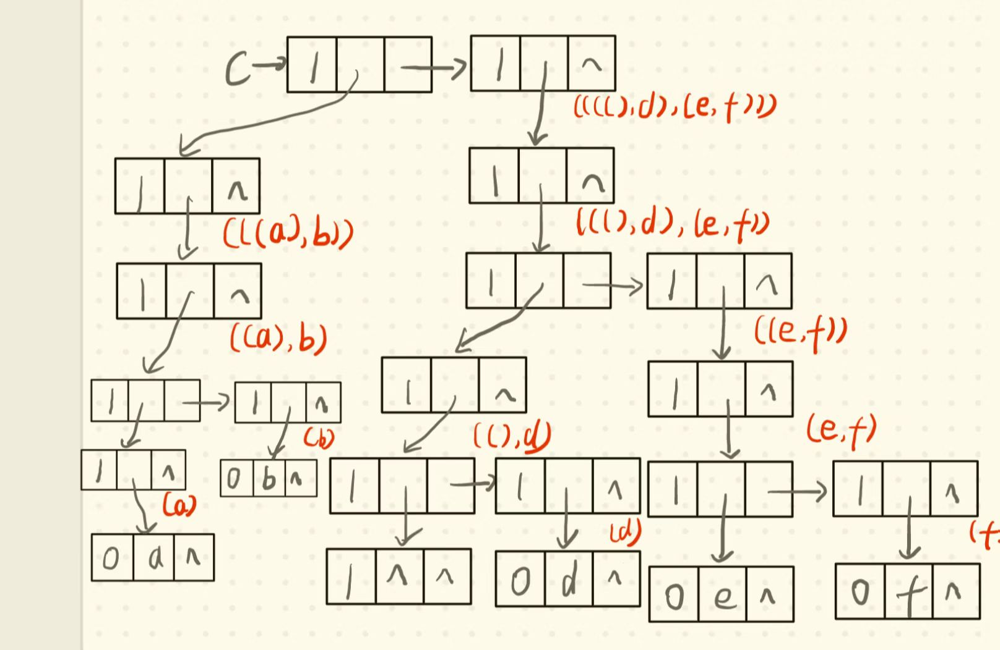
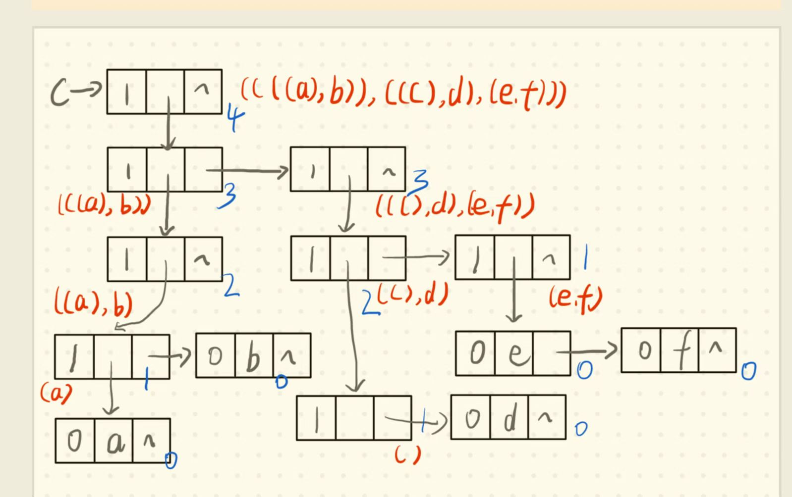

# 2022 数据结构-第五章 作业

## 一、基础知识题

1. #### 假设有二维数组$A_{6\times 8}$，每个元素用相邻的6个字节存储，存储器按字节编址。已知A的起始存储位置为1000，计算：

   1. ##### 数组A的体积（即存储量）

      > $6 \times 8 \times 6 = 288$

   2. ##### 数组A的最后一个元素$a_{57}$的第一个字节的地址

      > ${\rm LOC}(a_{57}) = 1000 + (8 \times 5 + 7) \times 6 = 1282$

   3. ##### 按行存储时（低下标优先），元素$a_{14}$的第一个字节的地址

      > ${\rm LOC}(a_{14}) = 1000 + (8 \times 1 + 4) \times 6 = 1072$

   4. ##### 按列存储时（高下标优先），元素$a_{47}$的第一个字节的地址

      > ${\rm LOC}(a_{47}) =  1000 + (6 \times 7 + 4) \times 6 = 1276$

2. #### 假设按低下标优先存储整数数据$A_{9*3*5*8}$时，第一个元素的字节地址是100，每个整数占四个字节。问元素$a_{1111} , a_{3125}$的存储地址分别是什么？

   > $$
   > {\rm LOC}(a_{1111}) = 100 + (1 \times 3 \times 5 \times 8 + 1 \times 5 \times 8 + 1 \times 8 + 1) \times 4 = 776 \\
   > {\rm LOC}(a_{3125}) = 100 + (3 \times 3 \times 5 \times 8 + 1 \times 5 \times 8 + 2 \times 8 + 5) \times 4 = 1784
   > $$
   >
   
3. #### 设有上三角矩阵$$(a_{ij})_{n*n}$$，将其上三角元素逐行存储在数组B[m]中(m充分大），使得$$B[k]=a_{ij}$$且$$k=f_1(i)+f_2(j)+c$$。试写出函数$$f_1,f_2和常数c$$。

   > $$
   > k  = ni - (n - j) - \dfrac{i(i-1)}{2} \\
   > f_1(i) = (n + \dfrac{1}{2})i - \dfrac{1}{2}i^2 \\
   > f_2(j) = j \\
   > c = -n
   > $$
   
4. #### 设有三对角矩阵$$(a_{ij})_{n*n}$$，将其三条对角线上的元素逐行存于数组B[3n-2]中，使得$$B[k]=a_{ij}$$，求用i，j表示k的下标变换公式，以及用k表示i，j的下标变换公式。

   > (1)
   > $$
   > k = 2(i - 1) + j - 1 \qquad (|i - j| \leqslant 1) \\
   > $$
   > (2)
   > $$
   > i = \lfloor (k + 1) / 3 \rfloor + 1 \qquad (0 \leqslant k \leqslant 3n - 1) \\
   > j = k + 1 - 2 \lfloor (k + 1) / 3\rfloor
   > $$

5. #### 广义表的`GetHead`和`GetTail`操作分别记做`GetHead【】`，`GetTail【】`

   1. 写出`GetHead【GetTail【GetHead【((a,b),(c,d))】】】`的结果。

      > `GetHead【 ((a,b),(c,d)) 】`返回第一个元素`(a,b)`
      > `GetTail(a,b)`返回除第一个元素外的子表`(b)`
      > `GetHead(b)`返回第一个元素`b`

   2. 写出`GetTail【GetHead【GetTail【((a,b),(c,d))】】】`的结果。

      > `GetTail【((a,b),(c,d))】`返回除第一个元素外的子表`((c,d))`
      >
      > `GetHead(c,d)`返回第一个元素`(c,d)`
      >
      > `GetTail(c,d)`返回除第一个元素外的子表`(d)`

   3. 参照上面两个例子写出从广义表`L1、L2`中利用一系列`GetHead、GetTail`操作取出原子项`banana`的方法。

      1. `L1=((((apple))),((pear)),(banana),orange)`;

         > `GetHead【GetHead【GetTail【GetTail【L1】】】】`

      2. `L2=(apple,(pear,(banana),orange))`;

         > `GetHead【GetHead【GetTail【GetHead【GetTail【L2】】】】】`

6. #### 画出广义表`((((a),b)),(((),d),(e,f)))`的存储结构，并求它的深度。

   > #### 广义表的深度为 4
   >
   > 
   >
   > 

## 二、算法设计题

1. #### 假设稀疏矩阵A和B均以三元组顺序表作为存储结构，试写出矩阵相加的算法，另设三元组表C存放结果矩阵。

   ```c++
   #define MAXSIZE 100
   typedef int ElemType;
   
   typedef struct {
       int row, col;
       ElemType e;
   } Triple;
   
   typedef struct {
       Triple data[MAXSIZE + 1];
       int mu, nu, tu;				// 行 列 非零元
   } TSMatrix;
   
   void initTSMatrix(TSMatrix &A) {
       A->mu = 10;
       A->nu = 10;
       A->tu = 0;
   }
   
   void addTriple(TSMatrix &A, int i, int j, int e) {
       A->data[++A->len].row = i;
       A->data[A->len].col = j;
       A->data[A->len].e = e;
   }
   
   void addTSMatrix(TSMatrix A, TSMatrix B, TSMatrix &C) {
       initTSMatrix(C);
       int i = 1, j = 1;
       while (i <= A->tu && j <= B->tu) {
           if (A->data[i].row < B->data[i].row) {
               addTriple(C, A->data[i].row, A->data[i].col, A->data[i].e);
               i++;
           } else if (A->data[i].row > B->data[i].row) {
               addTriple(C, B->data[i].row, B->data[i].col, B->data[i].e);
               j++;
           } else {
               if (A->data[i].col < B->data[i].col) {
                   addTriple(C, A->data[i].row, A->data[i].col, A->data[i].e);
                   i++;
               } else if (A->data[i].col > B->data[i].col) {
               	addTriple(C, B->data[i].row, B->data[i].col, B->data[i].e);
                   j++;
               } else {
              		addTriple(C, A->data[i].row,A->data[i].col, A->data[i].e + B->data[i].e);
                   i++, j++;
               }
           }
       }
       while (i <= A->len) {
       	addTriple(C, A->data[i].row, A->data[i].col, A->data[i].e);
           i++;
       }
       while (j <= B->len) {
           addTriple(C, A->data[i].row, A->data[i].col, A->data[i].e);
           i++;
       }
   }
   ```

2. #### 编写递归算法，输出广义表中的所有原子项及其所在层次。

   ```c++
   typedef enum {ATOM, LIST} ElemTag;
   typedef int ElemTag;
   typedef int AtomType;
   
   typedef struct GLNode {
       ElemTag tag;
       union {
           AtomType atom;
           struct {
               struct GLNode *hp, *tp;
           } ptr;
       }un;
   } *GList;
   
   void outAtom(GList A, int depth) {
       if (A) {
           if (A->tag == ATOM) {
               printf("%d %d\n", A->un.atom, depth);
           } else {
               outAtom(A->un.ptr.hp, depth + 1);
               outAtom(A->un.ptr.tp, depth);
           }
       }
   }
   ```