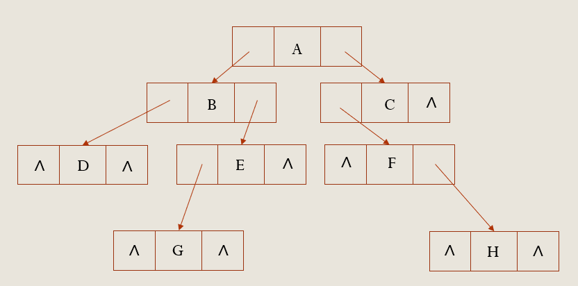

# 2022 数据结构-第六章 作业

## 一、选择题

1. 下列说法正确的是（==C==）

 A. 二叉树中的任何一个结点的度为2 

 B. 二叉树的度为2

 C. 一颗二叉树的度可小于2 

 D. 任何一颗二叉树中至少有一个结点的度为2

2. 以二叉链表作为二叉树的存储结构，在具有n个结点的二叉链表中，空指针域的个数为（==C==）

 A. 2n-1      B. n-1         C. n+1         D. 2n+1

3. 如果结点A有3个兄弟，而且B是A的双亲，则B的度为（==B==）

 A. 3           B. 4        C. 5             D. 1

4. 某二叉树T有n个结点，设按某种顺序对T中的每个结点进行编号，编号值为 $1,2\cdots n$。如果有如下性质：T中任意结点v，其编号等于左子树上的最小编号减1，而v的右子树的结点中，其最小编号等于v左子树上结点的最大编号加1，则这是按（==C==）编号的。

 A. 中序遍历序列       B. 先序遍历序列        C. 后序遍历序列         D. 层次遍历序列

5. 设F是一个森林，B是由F转换得到的二叉树，F中有n个非终端结点，B中右指针域为空的结点有（==C==）个

   A. n-1           B. n               C. n+1           D. n+2

6. 一颗完全二叉树上有1001个结点，其中叶子结点的个数是（==B==）

   A. 500           B. 501          C. 490           D. 495

7. 设森林F中有三棵树，第1、第2和第3棵树的结点个数分别为N1，N2,和N3。与森林F对应的二叉树根结点的右子树上的结点个数是（==D==）

​    A. N1            B. N1+N2      C.N2         D. N2+N3

8. 任何一棵二叉树的叶子结点在先序、中序、后序遍历序列中的相对次序（==A==）

   A. 不发生改变       B. 发生改变          C. 不确定 

9. 若一棵二叉树的后序遍历序列为dabec,中序遍历序列为debac, 则先序遍历序列为（==D==）

   A. cbeda               B. decab             C. deabc        D. cedba

10. 一棵非空二叉树的先序遍历序列与后序遍历序列正好相反，则该二叉树一定满足（==C==）

 A. 所有的结点均无左孩子        B. 所有的结点均无右孩子

 C.只有一个叶子结点                D. 是一棵满二叉树

11. 设高度为h的二叉树上只有度为0和度为2的结点，则此类二叉树中所包含的结点数至少为（==B==）

  A. 2h          B. 2h-1           C. 2h+1           D. h+1 

## 二、判断题

1. 由树转换成二叉树，其根结点的右子树总是空的（:heavy_check_mark:）
2. 完全二叉树中，若一个结点没有左孩子，则它必是叶子结点（:heavy_check_mark:）
3. 若一个结点是某二叉树子树的中序遍历序列中的第一个结点，则它必是该子树的后序遍历序列中的第一个结点（:x:）
4. 对一棵二叉树进行层次遍历时，应借助一个栈（:x:）
5. 完全二叉树可采用顺序存储结构实现，非完全二叉树则不能（:x:)

## 三、简答题

1. 一棵度为2的树与一棵二叉树有何区别？

   > 1. 度不同
   >
   > 度为2的树要求每个节点最多只能有两棵子树，并且至少有一个节点有两棵子树。二叉树的要求是度不超过2，节点最多有两个叉，可以是1或者0。
   >
   > 在任意一棵二叉树中，叶子结点总是比度为2的结点多一个。
   >
   > 2. 分支不同
   >
   > 度为2的树有两个分支，但分支没有左右之分；
   > 一棵二叉树也有两个分支，但有左右之分，左右子树的次序不能随意颠倒。
   >
   > 3. 次序不同
   >
   > 度为2的树从形式上看与二叉树很相似，但它的子树是无序的，而二叉树是有序的。即，在一般树中若某结点只有一个孩子，就无需区分其左右次序，而在二叉树中即使是一个孩子也有左右之分。

2. 一棵深度为H的满k叉树有如下性质：第H层上的结点都是叶子结点，其余各层上每个结点都有k棵非空子树。如果按层次顺序从1开始对全部结点编号，问：

   1. 各层的结点数目是多少？

      > 第 $i$ 层的结点数目为 $k^{i-1}$，总的节点数为 $\sum_{i=1}^n k^{i-1} = \dfrac{k^n - 1}{k - 1}$

   2. 编号为p的结点的父结点的编号是多少？

      > 若编号为1，则没有根节点
      >
      > 若编号不为1
      >
      > 若p是其父节点的最右边的孩子，则父结点编号为 $\dfrac{p - 1}{k}$，若为最左边的孩子，则父结点编号为 $\dfrac{p + k - 2}{k}$，
      >
      > 那么对于一个编号为p的结点，其父结点编号为 $\lfloor \dfrac{p + k - 2}{k}\rfloor$

   3. 编号为p的结点的第i个孩子结点(若存在）的编号是多少？

      > 结点p的最右孩子编号为 $kp + 1$，最左孩子编号为 $k(p - 1) + 2$
      >
      > 那么第 $i$ 个孩子的编号为 $k(p - 1) + i + 1$

   4. 编号为p的结点有右兄弟的条件是什么？其右兄弟的编号是多少？

      > 当 $(p - 1) \% k \neq 0$ 时，结点p有右兄弟，其编号为$p + 1$

3. 对于下图所示的二叉树，请画出

   

   1. 顺序存储结构

      > | $A$  | $B$  | $C$  | $D$  | $E$  | $F$  | $\land$ | $\land$ | $\land$ | $G$  | $\land$ | $\land$ | $H$  |
      > | :--: | :--: | :--: | :--: | :--: | :--: | :-----: | :-----: | :-----: | :--: | :-----: | :-----: | :--: |

   2. 二叉链表存储结构

      > 

   3. 二叉中序线索结构

      > 

   4. 将本叉树转换成相应的森林

      > 

4. 假设用于通信的电文由字符集{a,b,c,d,e,f,g}中的字母构成，他们在电文中出现的频度分别为{0.31,0.16,0.10,0.08,0.11,0.20,0.04}

   1. 请为这7个字母设置哈夫曼编码

      > 按照频度升序排序有 {g,d,c,e,b,f,a}，对应频次为{4，8，10，11，16，20，31}，构造对应的哈夫曼树
      >
      > 
      >
      > 令左分支为0，右分支为1，可得到对应编码
      >
      > $a:11$
      >
      > $b:101$
      >
      > $c:010$
      >
      > $d:1001$
      >
      > $e:011$
      >
      > $f:00$
      >
      > $g:1000$

   2. 整个哈夫曼树的`WPL`是多少

      > $$
      > \begin{align}
      > {\rm WPL} &= 20 * 2 + 10 * 3 + 11 * 3 + 4 * 4 + 8 * 4 + 16 * 3 + 31 * 2 \\
      > &= 40 + 30 + 33 + 16 + 32 + 48 + 62 = 261
      > \end{align}
      > $$
      >
      > 
   
   3. 对这7个字母进行等长编码，至少需要几位二进制数，哈夫曼编码比等长编码使电文总长度压缩了多少？
   
      > 一共7个字母，$\lceil \log_27\rceil = 3$，以 $a:000$ 开始，至少需要3为二进制数
      >
      > 采用这种方式编码一共需要 $3 * 100 = 300$ 位，哈夫曼编码节省了39位，故压缩了39，即$\dfrac{39}{300} \times 100\%= 13\%$

## 四、算法题

1. 为二叉链表的结点增加`DescNum`域，写出该结点的定义，并写一算法，求二叉树的每个结点的子孙数目并存入其`DescNum`域

   ```c++
   typedef int TElemType;
   typedef struct BiTNode {
     TElemType data;
     int DescNum;
     struct BiTNode *lchild, *rchild;
   } BiTNode, *BiTree;
   
   int descNum_recursion(BiTree T) {
     if (T == nullptr) {
       return -1;
     }
     T->DescNum = descNum_recursion(T->lchild) + descNum_recursion(T->rchild) + 2;
     return T->DescNum;
   }
   ```

2. 试编写算法，求一棵以孩子-兄弟链表表示的树的叶子的个数

   ```c++
   typedef int TElemType;
   typedef struct CSNode {
     TElemType data;
     struct CSNode* lchild;
     struct CSNode* nextsibling; 
   } CSNode, *CSTree;
   
   int leafNum(CSTree T) {
     if (T->firstchild) {
       return 1;
     }
     int cnt = 0;
     for (p = T->firstchild; p; p->nextsibling) {
       cnt += leafNum(p);
     }
     return cnt;
   }
   ```

3. 试编写算法，求一棵以孩子-兄弟链表表示的树的度

   ```c++
   typedef int TElemType;
   typedef struct CSNode {
     TElemType data;
     int degree;
     struct CSNode* firstchild;
     struct CSNode* nextsibling; 
   } CSNode, *CSTree;
   
   int treeDegree(CSTree T) {
     if (!T->firstchild) {
       return 0;
     }
     int degree = 0;
     for (p = T->firstchild; p; p->nextsibling) {
       degree++;
     }
     for (p = T->firstchild; p; p->nextsibling) {
       d = treeDegree(p);
       if (d > degree) {
         degree = d;
       }
     }
     return d;
   }
   ```