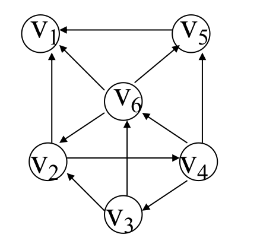
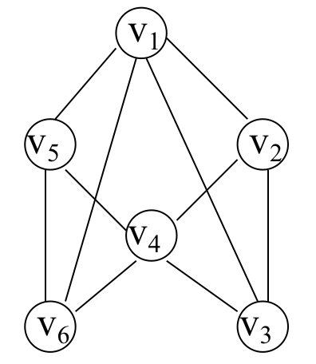
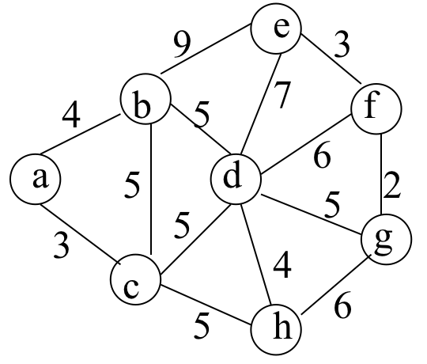
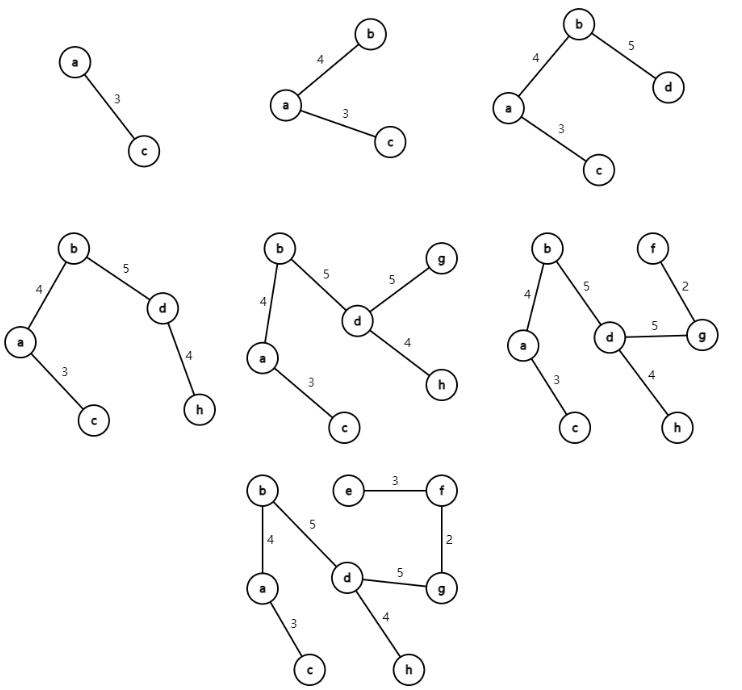
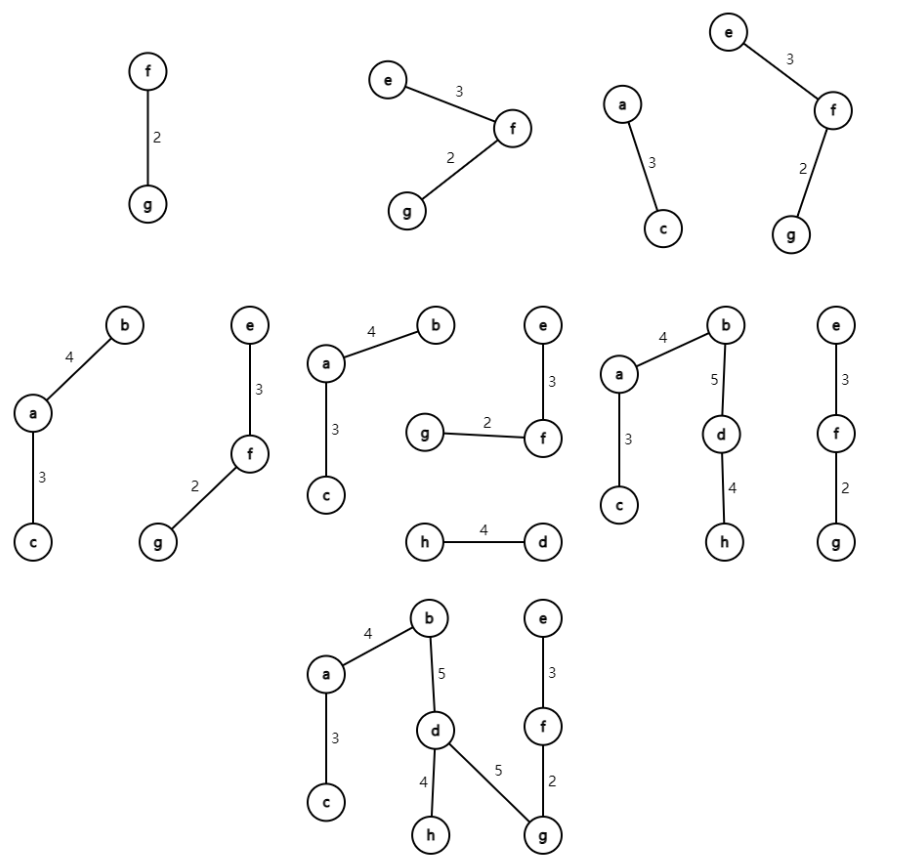
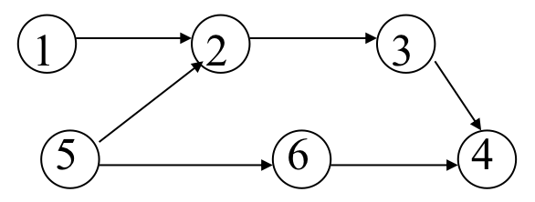
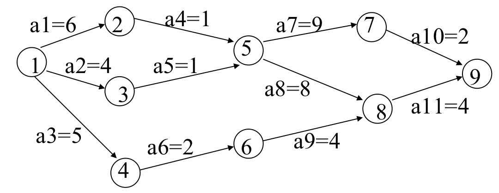
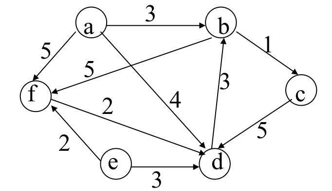

# 2022 数据结构-第七章 作业

## 一、选择题：

1. 在$n$条边的无向图的邻接表存储中，边结点的个数有(==B==)个 ？

   A. $n$

   B. $2n$

   C. $n/2$

   D. $n*n$

2. 已知无向图G含有16条边，其中度为4的顶点个数为3，度为3的顶点个数为4，其它顶点的度均小于3。则图G中所含的顶点数至少是(==B==)

   A. 10 

   B. 11

   C. 13

   D. 15

3. $n$个顶点的有向连通图，至少需要(==B==)条弧

   A. $n-1$

   B. $n$

   C. $n+1$

   D. $2n$

4. 下列哪一种图的邻接矩阵是对称矩阵？(==B==)

   A. 有向图

   B. 无向图

   C. 有向无环图

   D. 有向带权图

## 二、判断题：

1. 求最小生成树的Prim算法在边较少、结点较多时效率较高(:x:)
2. 图的最小生成树的形状可能不唯一(:heavy_check_mark:)
3. 用邻接矩阵存储一个图时，在不考虑压缩存储的情况下，所占用的存储空间大小只与图中结点个数有关，而与图的边数无关(:heavy_check_mark:) 
4. 邻接表法只用于有向图的存储，邻接矩阵对于有向图和无向图的存储都适用(:x:) 
5. 任何无向图都存在生成树(:x:) 
6. 连通分量是无向图中的极小连通子图(:x:) 
7. 关键路径是AOE网中从源点到汇点的最短路径(:x:)

## 三、简答题

1. ### 请给出下图所示有向图的

   

   #### (1) 每个顶点的入/出度

   > | 顶点  | 入度 | 出度 |
   > | :---: | :--: | :--: |
   > | $V_1$ | $3$  | $0$  |
   > | $V_2$ | $2$  | $2$  |
   > | $V_3$ | $1$  | $2$  |
   > | $V_4$ | $1$  | $3$  |
   > | $V_5$ | $2$  | $1$  |
   > | $V_6$ | $2$  | $3$  |

   #### (2) 邻接矩阵

   > |       |  1   |  2   |  3   |  4   |  5   |  6   |
   > | :---: | :--: | :--: | :--: | :--: | :--: | :--: |
   > | **1** | $0$  | $0$  | $0$  | $0$  | $0$  | $0$  |
   > | **2** | $1$  | $0$  | $0$  | $1$  | $0$  | $0$  |
   > | **3** | $0$  | $1$  | $0$  | $0$  | $0$  | $1$  |
   > | **4** | $0$  | $0$  | $1$  | $0$  | $1$  | $1$  |
   > | **5** | $1$  | $0$  | $0$  | $0$  | $0$  | $0$  |
   > | **6** | $1$  | $1$  | $0$  | $0$  | $1$  | $0$  |

   #### (3) 逆邻接表

   > $$
   > \begin{align}
   > 0:&V_1 \to 5 \to 4 \to 1 \to \land \\
   > 1:&V_2 \to 5 \to 2 \to \land \\
   > 2:&V_3 \to 3 \to \land \\
   > 3:&V_4 \to 1 \to \land \\
   > 4:&V_5 \to 5 \to 3 \to \land \\
   > 5:&V_6 \to 3 \to 2 \to \land 
   > \end{align}
   > $$

   #### (4) 强连通分量

   > $\{1\},\{5\},\{2,3,4,6\}$

2. ### 针对下图所示的无向图

   

   #### (1) 画出邻接表，它所邻接到的顶点序号由小到大排列

   > $$
   > \begin{align}
   > 0:&V_1 \to 1 \to 2 \to 4 \to 5 \to \land \\
   > 1:&V_2 \to 0 \to 2 \to 3 \to \land \\
   > 2:&V_3 \to 0 \to 1 \to 3 \to \land \\
   > 3:&V_4 \to 1 \to 2 \to 4 \to 5 \to \land \\
   > 4:&V_5 \to 0 \to 3 \to 5 \to \land \\
   > 5:&V_6 \to 0 \to 3 \to 4 \to \land 
   > \end{align}
   > $$

   #### (2) 基于上述邻接表结构，列出从顶点1出发深度优先搜索遍历该图所得顶点序列和边的序列

   > $V_1, V_2,V_3,V_4,V_5,V_6$
   >
   > $E_{12},E_{23},E_{34},E_{45},E_{56}$

   #### (3) 基于上述邻接表结构，列出从顶点1出发广度优先搜索遍历该图所得顶点序列和边的序列

   > $V_1,V_2,V_3,V_5,V_6,V_4$
   >
   > $E_{12},E_{13},E_{15},E_{16},E_{24}$

3. ### 分别画出按以下两种算法求所示无向带权图的最小生成树的过程

   

   #### (1) `Prim`算法

   >

   #### (2) `Kruskal`算法

   > 

4. ### 试列出下图中全部可能的拓扑有序序列，并指出应用教材中算法7.12`TopologicalSort`求得的是哪一个

   

   > $1,5,2,3,6,4$
   >
   > $1,5,2,6,3,4$
   >
   > $1,5,6,2,3,4$
   >
   > $5,1,2,3,6,4$
   >
   > $5,1,2.6,3,4$
   >
   > $5,1,6,2,3,4$
   >
   > $5,6,1,2,3,4$ 
   >
   > 7.12`TopologicalSort`求解的是最后一个$5,6,1,2,3,4$

5. ### 对于如下`AOE`网络求关键路径

   

   >$$
   >\begin{align}
   >&ve[1] = 0  \qquad vl[1] = 0 \\
   >&ve[2] = 6  \qquad vl[2] = 6 \\
   >&ve[3] = 4  \qquad vl[3] = 6 \\
   >&ve[4] = 5  \qquad vl[4] = 9 \\
   >&ve[5] = 7  \qquad vl[5] = 7 \\
   >&ve[6] = 7  \qquad vl[6] = 11\\
   >&ve[7] = 16 \ \ \quad vl[7] = 17 \\
   >&ve[8] = 15 \ \ \quad vl[8] = 15 \\
   >&ve[9] = 19 \ \ \quad vl[9] = 19 \\
   >\end{align}
   >$$
   >
   >$$
   >\begin{align}
   >a1:& e[1] = 0 \qquad l[1] = 0\\
   >a2:& e[2] = 0 \qquad l[2] = 2\\
   >a3:& e[3] = 0 \qquad l[3] = 4\\
   >a4:& e[4] = 6 \qquad l[4] = 6\\
   >a5:& e[5] = 4 \qquad l[5] = 6\\
   >a6:& e[6] = 5 \qquad l[6] = 9\\
   >a7:& e[7] = 7 \qquad l[7] = 8\\
   >a8:& e[8] = 7 \qquad l[8] = 7\\
   >a9:& e[9] = 7 \qquad l[9] = 11\\
   >a10:& e[10] = 16 \quad l[10] = 17\\
   >a11:& e[11] = 15 \quad l[11] = 15\\
   >\end{align}
   >$$
   >
   >因此，关键路径为$a1,a4,a8,a11$

   6. ### 对于下图

      

      #### (1) 使用Dijkstra算法求从a出发到其它顶点的最短路径，画出依次产生各顶点的最短路径的过程

      > | 选中b点 |  a   |  b   |  c   |  d   |    e     |  f   |
      > | :-----: | :--: | :--: | :--: | :--: | :------: | :--: |
      > | $dist$  |  0   |  3   |  4   |  4   | $\infty$ |  5   |
      >
      > | 选中c点 |  a   |  b   |  c   |  d   |    e     |  f   |
      > | :-----: | :--: | :--: | :--: | :--: | :------: | :--: |
      > | $dist$  |  0   |  3   |  4   |  4   | $\infty$ |  5   |
      >
      > | 选中d点 |  a   |  b   |  c   |  d   |    e     |  f   |
      > | :-----: | :--: | :--: | :--: | :--: | :------: | :--: |
      > | $dist$  |  0   |  3   |  4   |  4   | $\infty$ |  5   |
      >
      > | 选中f点 |  a   |  b   |  c   |  d   |    e     |  f   |
      > | :-----: | :--: | :--: | :--: | :--: | :------: | :--: |
      > | $dist$  |  0   |  3   |  4   |  4   | $\infty$ |  5   |

      #### (2) 使用Floyd算法求各顶点之间的最短路径，画出求解过程。

      > |       |    a     |    b     |    c     |    d     |    e     |    f     |
      > | :---: | :------: | :------: | :------: | :------: | :------: | :------: |
      > | **a** |    0     |    3     | $\infty$ |    4     | $\infty$ |    5     |
      > | **b** | $\infty$ |    0     |    1     | $\infty$ | $\infty$ |    5     |
      > | **c** | $\infty$ | $\infty$ |    0     |    5     | $\infty$ | $\infty$ |
      > | **d** | $\infty$ |    3     | $\infty$ |    0     | $\infty$ | $\infty$ |
      > | **e** | $\infty$ | $\infty$ | $\infty$ |    3     |    0     |    2     |
      > | **f** | $\infty$ | $\infty$ | $\infty$ |    2     | $\infty$ |    0     |
      >
      > | a为中间结点 |    a     |    b     |    c     |    d     |    e     |    f     |
      > | :---------: | :------: | :------: | :------: | :------: | :------: | :------: |
      > |    **a**    |    0     |    3     | $\infty$ |    4     | $\infty$ |    5     |
      > |    **b**    | $\infty$ |    0     |    1     | $\infty$ | $\infty$ |    5     |
      > |    **c**    | $\infty$ | $\infty$ |    0     |    5     | $\infty$ | $\infty$ |
      > |    **d**    | $\infty$ |    3     | $\infty$ |    0     | $\infty$ | $\infty$ |
      > |    **e**    | $\infty$ | $\infty$ | $\infty$ |    3     |    0     |    2     |
      > |    **f**    | $\infty$ | $\infty$ | $\infty$ |    2     | $\infty$ |    0     |
      >
      > | b为中间结点 |    a     |    b     |    c     |    d     |    e     |    f     |
      > | :---------: | :------: | :------: | :------: | :------: | :------: | :------: |
      > |    **a**    |    0     |    3     |    4     |    4     | $\infty$ |    5     |
      > |    **b**    | $\infty$ |    0     |    1     | $\infty$ | $\infty$ |    5     |
      > |    **c**    | $\infty$ | $\infty$ |    0     |    5     | $\infty$ | $\infty$ |
      > |    **d**    | $\infty$ |    3     |    4     |    0     | $\infty$ |    8     |
      > |    **e**    | $\infty$ | $\infty$ | $\infty$ |    3     |    0     |    2     |
      > |    **f**    | $\infty$ | $\infty$ | $\infty$ |    2     | $\infty$ |    0     |
      >
      > | c为中间结点 |    a     |    b     |    c     |  d   |    e     |    f     |
      > | :---------: | :------: | :------: | :------: | :--: | :------: | :------: |
      > |    **a**    |    0     |    3     |    4     |  4   | $\infty$ |    5     |
      > |    **b**    | $\infty$ |    0     |    1     |  6   | $\infty$ |    5     |
      > |    **c**    | $\infty$ | $\infty$ |    0     |  5   | $\infty$ | $\infty$ |
      > |    **d**    | $\infty$ |    3     |    4     |  0   | $\infty$ |    8     |
      > |    **e**    | $\infty$ | $\infty$ | $\infty$ |  3   |    0     |    2     |
      > |    **f**    | $\infty$ | $\infty$ | $\infty$ |  2   | $\infty$ |    0     |
      >
      > | d为中间结点 |    a     |  b   |  c   |  d   |    e     |  f   |
      > | :---------: | :------: | :--: | :--: | :--: | :------: | :--: |
      > |    **a**    |    0     |  3   |  4   |  4   | $\infty$ |  5   |
      > |    **b**    | $\infty$ |  0   |  1   |  6   | $\infty$ |  5   |
      > |    **c**    | $\infty$ |  8   |  0   |  5   | $\infty$ |  13  |
      > |    **d**    | $\infty$ |  3   |  4   |  0   | $\infty$ |  8   |
      > |    **e**    | $\infty$ |  6   |  7   |  3   |    0     |  2   |
      > |    **f**    | $\infty$ |  5   |  6   |  2   | $\infty$ |  0   |
      >
      > | f为中间结点 |    a     |  b   |  c   |  d   |    e     |  f   |
      > | :---------: | :------: | :--: | :--: | :--: | :------: | :--: |
      > |    **a**    |    0     |  3   |  4   |  4   | $\infty$ |  5   |
      > |    **b**    | $\infty$ |  0   |  1   |  6   | $\infty$ |  5   |
      > |    **c**    | $\infty$ |  8   |  0   |  5   | $\infty$ |  13  |
      > |    **d**    | $\infty$ |  3   |  4   |  0   | $\infty$ |  8   |
      > |    **e**    | $\infty$ |  6   |  7   |  3   |    0     |  2   |
      > |    **f**    | $\infty$ |  5   |  6   |  2   | $\infty$ |  0   |
