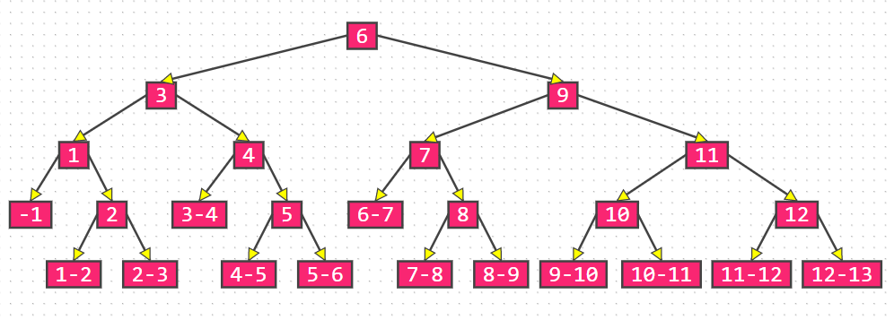
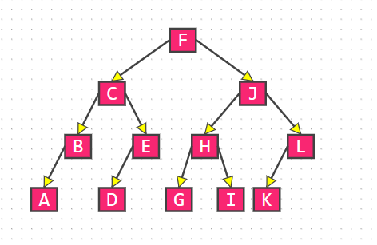
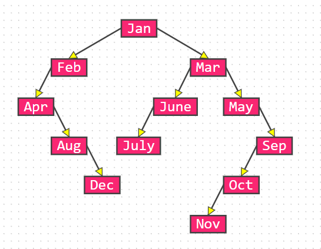
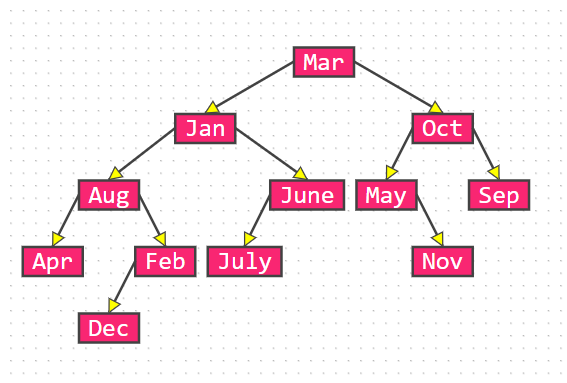
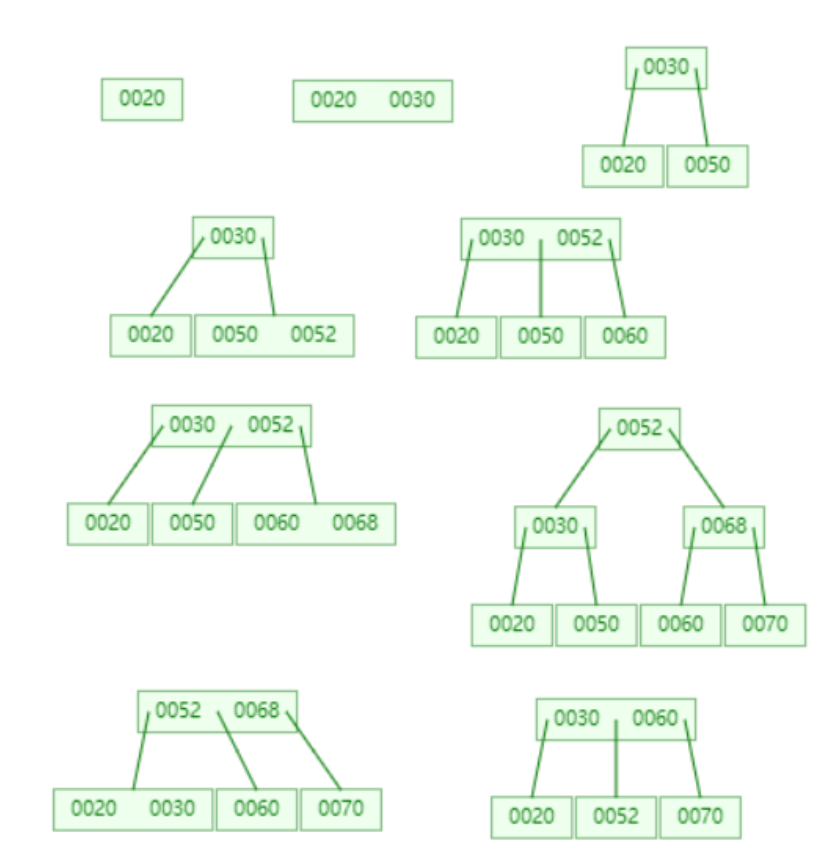

# 2022数据结构 第九章 作业

# 一、本章学习要点

1. 顺序表和有序表的查找方法及其平均查找长度ASL的计算方法。
2. 了解静态查找树的构造方法和查找方法及其和有序表的差别。
3. 熟练掌握二叉排序树以及平衡二叉树的构造和查找方法。
4. 理解B-树和B+树的结构特点以及它们各自查找过程的不同之处。
5. 熟练掌握哈希表的构造方法，深刻理解哈希表与其它结构的表的实质性的差别。
6. 掌握按定义计算各种查找方法在等概率情况下查找成功时的平均查找长度。

# 二、作业

## 2.1 选择题

1. 在表长为n的顺序表上实施顺序查找，在查找不成功时与关键字比较的次数为（==C==）

   A. n     B. 1         C. n+1        D. n-1

2. 适用于折半查找的表的存储方式及元素排列要求为（==D==）

   A. 链式存储，元素无序    B. 链式存储，元素有序     C.顺序存储，元素无序   D. 顺序存储，元素有序

3. 在有序表`{1,3,9,12,32,41,62,75,77,82,95,100}`上进行折半查找关键字为82的数据元素需要比较（==C==）次

   A. 1               B. 2                  C. 4              D. 5

4. 具有五层结构的`AVL`树至少有（==B==）个结点

   A. 10              B. 12                 C. 15             D. 17

5. 以下关于B-树和B+树的说法正确的是（==D==）

   A. B-树和B+树都能有效的支持顺序查找

   B. m阶B-树中的每个结点的子树个数都大于或等于m/2上取整

   C. m阶B+树中具有k个子树的非叶子结点含有k-1个关键字

   D. m阶B-树中任何一个结点的子树高度都相等

6. 下面关于散列表查找说法不正确的有（==A==）个

   A. 采用链地址法解决冲突时，查找一个元素的时间是相同的

   B. 采用链地址法解决冲突时，若规定插入总是在链首，则插入任一个元素的时间是相同的

   C. 采用链地址法解决冲突容易引起聚集现象D. 再散列法不易产生聚集

7. 设散列表长为14，散列函数为`H(key)=key%11`，当前表中已有4个结点：`addr(15)=4`, `addr(38)=5`, `addr(61)=6`, `addr(84)=7`。如用二次探测再散列处理冲突，则关键字为49的结点的地址是（==D==）

   A. 8                B. 3                C. 5                D. 9

## 2.2 应用题

1. 已知含12个关键字的有序表及其相应权值为：

| 序号   | 1    | 2    | 3    | 4    | 5    | 6    | 7    | 8    | 9    | 10   | 11   | 12   |
| ------ | ---- | ---- | ---- | ---- | ---- | ---- | ---- | ---- | ---- | ---- | ---- | ---- |
| 关键字 | A    | B    | C    | D    | E    | F    | G    | H    | I    | J    | K    | L    |
| 权值   | 4    | 6    | 3    | 4    | 9    | 3    | 2    | 6    | 1    | 5    | 3    | 4    |

 (1) 画出对以上有序表进行折半查找的判定树，求折半查找时查找成功的平均查找长度ASL

> 
> $$
> \begin{align}
> ASL_s & = \dfrac{1}{n}\sum\limits^{h}_{j=1}j\cdot 2^{j-2} \\
> 			& = \dfrac{1\times1+2\times2+3\times4+4\times5}{12} \\
> 			& = \dfrac{37}{12}
> \end{align}
> $$
>

   (2) 按次优查找树的构造算法画出次优查找树，并计算平均查找长度ASL

> |        j         |  1   |  2   |  3   |  4   |  5   |  6   |  7   |  8   |  9   |  10  |  11  |  12  |
> | :--------------: | :--: | :--: | :--: | :--: | :--: | :--: | :--: | :--: | :--: | :--: | :--: | :--: |
> |    **关键字**    |  A   |  B   |  C   |  D   |  E   |  F   |  G   |  H   |  I   |  J   |  K   |  L   |
> |     **权值**     |  4   |  6   |  3   |  4   |  9   |  3   |  2   |  6   |  1   |  5   |  3   |  4   |
> |    $\rm SW_j$    |  4   |  10  |  13  |  17  |  26  |  29  |  31  |  37  |  38  |  43  |  46  |  50  |
> | $\rm \Delta P_j$ |  46  |  36  |  27  |  20  |  7   |  5   |  10  |  18  |  25  |  31  |  39  |  46  |
> | $\rm \Delta P_j$ |  22  |  12  |  3   |  4   |  17  |      |  19  |  11  |  4   |  2   |  10  |  17  |
> | $\rm \Delta P_j$ |  6   |  4   |      |  9   |  4   |      |  7   |  1   |  8   |      |  6   |  3   |
> | $\rm \Delta P_j$ |  0   |      |      |  0   |      |      |  0   |      |  0   |      |  0   |      |
>
> 
> $$
> ASL = \dfrac{3\times1+8\times2+25\times3+14\times4}{50} = 3
> $$

2. 已知如下长度为12的表：`(Jan, Feb, Mar, Apr, May, June, July, Aug, Sep, Oct, Nov, Dec)`

   (1) 试按表中元素的顺序依次插入一棵初始为空的二叉排序树，请画出插入完成之后的二叉排序树，并求其在等概率的情况下查找成功的平均查找长度ASL。（关键字按字母表顺序排序，第一个字母相同的，比较第二个字母）

   > 
   > $$
   > ASL = \dfrac{1\times1+2\times2+3\times3+4\times3+5\times2+6\times1}{12} = \dfrac{7}{2}
   > $$

   (2) 按表中元素的顺序构造一棵平衡二叉排序树，并求其在等概率的情况下查找成功的平均查找长度ASL。

   > 
   > $$
   > ASL=\dfrac{1\times1+2\times2+3\times4+4\times4+5\times1}{12} = \dfrac{19}{6}
   > $$

3. 试从空树开始，画出按以下次序向3阶B-树中插入关键码的建树过程：20，30，50，52，60，68，70。如果此后删除50和68，画出每一步执行后B-树的状态。

   > 

4. 选取哈希函数`H(k)=(3k) MOD 11`

   (1) 用线性探测开放定址法处理冲突

   > |  i   |  0   |  1   |  2   |  3   |  4   |  5   |  6   |  7   |  8   |  9   |  10  |
   > | :--: | :--: | :--: | :--: | :--: | :--: | :--: | :--: | :--: | :--: | :--: | :--: |
   > | data |  22  |      |  41  |  30  |  01  |  53  |  46  |  13  |  67  |      |      |
   > |  c   |  1   |      |  1   |  2   |  2   |  1   |  1   |  2   |  6   |      |      |
   >
   > |                |                                             |
   > | :------------: | :-----------------------------------------: |
   > |  **查找成功**  | $\dfrac{1\times4+2\times3+6\times1}{8} = 2$ |
   > | **查找不成功** |   $\dfrac{2+1+8+7+6+5+4+3+2+1+1}{8} = 5$    |
   > |  **填充因子**  |               $\dfrac{8}{11}$               |

   (2) 用链地址法处理冲突

   > |  i   |    0    |    1    |    2    |    3    |    4    |    5    |    6    |    7    |    8    |    9    |   10    |
   > | :--: | :-----: | :-----: | :-----: | :-----: | :-----: | :-----: | :-----: | :-----: | :-----: | :-----: | :-----: |
   > | data |   22    | $\land$ |   30    |   67    | $\land$ |   53    |   13    | $\land$ | $\land$ | $\land$ | $\land$ |
   > | data | $\land$ |         |   41    |   01    |         | $\land$ |   46    |         |         |         |         |
   > | data |         |         | $\land$ | $\land$ |         |         | $\land$ |         |         |         |         |
   >
   > |                |                                                         |
   > | :------------: | :-----------------------------------------------------: |
   > |  **查找成功**  |     $\dfrac{1\times5+3\times2}{8} = \dfrac{11}{8}$      |
   > | **查找不成功** | $\dfrac{1\times6+2\times2+3\times3}{8} = \dfrac{19}{8}$ |
   > |  **填充因子**  |                     $\dfrac{5}{11}$                     |

   试在0~10的散列地址空间中对关键字序列(22, 41, 53, 46, 30, 13, 01, 67)造哈希表，并求等概率情况下查找成功时的平均查找长度和不成功时的平均查找长度以及装填因子。

## 2.3 算法题

1. 编写一个算法，利用折半查找算法在一个有序表中查找最后一个值小于或等于给定值的元素

   ```c++
   int lowerbound(SSTable ST, keytype key)
   {
     int l = 1, r = ST.length;
     while (l < r) {
       int mid = l + r + 1 >> 1;
       if (ST.elem[mid].key <= key) {
         l = mid;
       } else {
         r = mid - 1;
       }
     }
     if (l > ST.lenth || ST.elem[l].key != key) {
       return 0;
     }
     return l;
   }
   ```

2. 编写一个算法，利用折半查找算法在一个有序表中插入一个元素x，并保持表的有序性。

   ```c++
   /* 查找大于key的第一个元素 */
   int upperbound(STTable ST, keytype key) {
     int l = 1, r = ST.length;
     while (l < r) {
       int mid = l + r >> 1;
       if (ST.elem[mid].key > key) {
         r = mid;
       } else {
         l = mid + 1;
       }
     }
     return l;
   }
   
   /* 默认空间足够大 */
   void insert(STTable ST, keytype x) {
     int pos = upperbound(ST, x);
     for (int i = ST.lenth + 1; i > pos; i--) {
       ST.elem[i] = ST.elem[i - 1];
     }
     if (ST.elem[pos] <= x) {
       ST.elem[pos + 1] = x;
     } else {
     	ST.elem[pos] = x;
     }
   }
   ```

3. 编写递归算法，从大到小输出给定二叉排序树中所有关键字不小于x的数据元素。

   ```c++
   void InOrder(BiTree root, int x) {
     if (!root) {
       return;
     }
     InOrder(root->rchild, x);
     if (root->data >= x) {
       visist(root);
     }
     Inorder(root->lchild, x);
   }
   ```